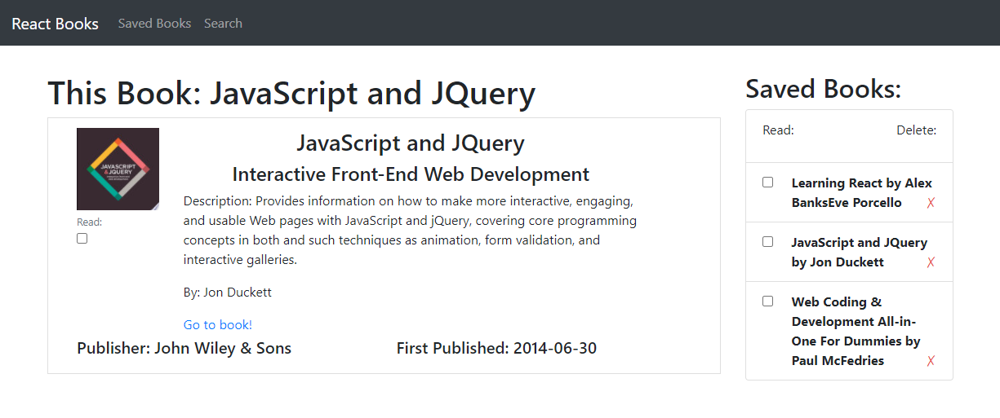
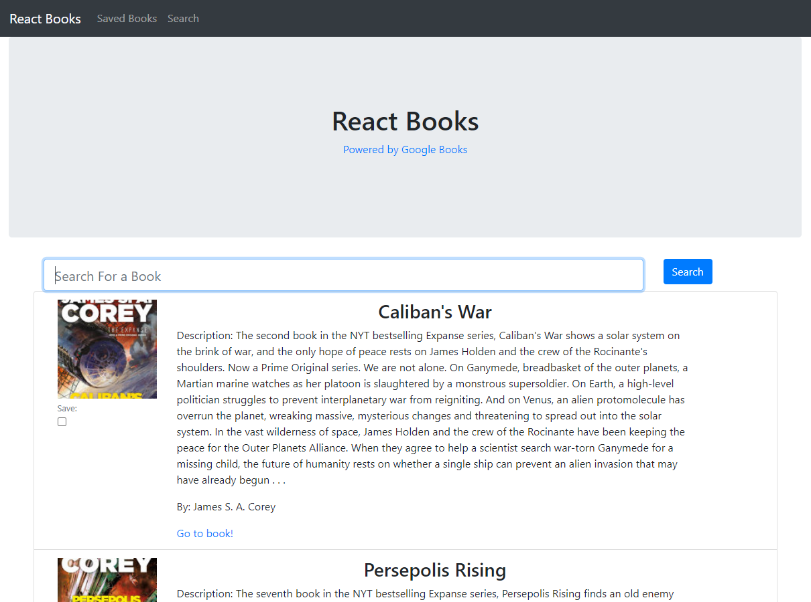

# Books Search React App
  

  ## Description:

A React-based Google Books Search App, demonstrating full MERN-stack capabilities. Users can add new books to their collection using Google's Book Search API, then can view their collection and mark books as read or remove them entirely.

[Link to the Deployed Site](https://evening-basin-07741.herokuapp.com/)     ||    [Link to the GitHub Repo](https://github.com/GAFelton/books-search-react-app)



  ## Table of Contents

 * [Installation](#Installation)
 * [Usage](#Usage)
 * [License](#License)
 * [Contributing](#Contributing)
 * [Questions](#Questions)

  

  ## Installation

1. Fork the [repo](https://github.com/GAFelton/books-search-react-app).

2. Clone the repo to your local machine.

3. On your local repo, run `npm install` in the root folder to install npm packages from both package.json files.

4. Create a MongoDB database called `reactgooglebookssearch`, and make sure `mongod.exe` is running whenever you want to test the app locally.

5. Create a  file titled `.env` in the root folder. Inside it, you will include your Google Books API key. (Sign up for a key [here](https://console.developers.google.com/).)
   Format for .env file:

   ```
   BOOKS_API_KEY={your-secret-here}
   ```

6. Run `npm start` to start your node server, and visit `localhost:3000` to interact with Google Books Search.

  

  ## Usage

Use the search page to find and add books to your saved collection. On the saved page, click on each book to learn more, mark them as read, or remove them from your collection entirely.



  ## License

  [MIT](./LICENSE)

  

  ## Contribution Guidelines

  Reach out if you'd like to collaborate.  Raising an issue, or Pull Requests are welcome!


  ## Questions

  Please address questions to [GAFelton](https://github.com/GAFelton). ([E-mail](64555318+GAFelton@users.noreply.github.com))
